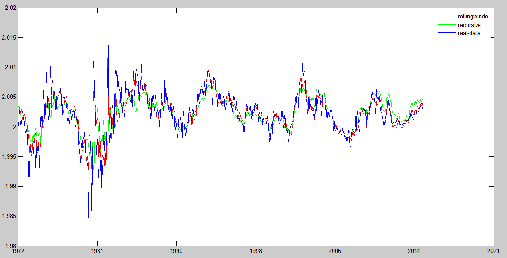
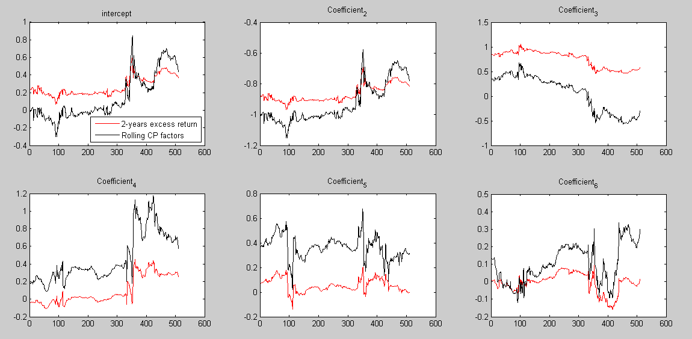

# Adaptive Penalized MacroFactor


##  **Coefficient**

```yaml
Name of QuantLet : Decision Tree and Random Forest

Published in : 'Unpublished; Theoretical description 
of tree and random forest model in: Daniel Jacob - 
Fruehsignale fuer Aenderungen von Konjunkturindikatoren 
durch Analysen von Big Data'

Description : 'Builds a classification tree to predict, 
wheather the customer choose the Citrus Hill (CH) or the
Minute Maid (MM) Orange Juice. A number of characteristics 
is used in order to grow a tree. The second part builds 
a random forest with the same dataset. A visualization 
of the error terms are shown.'

Keywords : 'tree, decision-tree, regression, classification,
simulation, random-forest, plot, graphical representation,
visualization'

See also : 

Author : Xinjue Li

Submitted : 

Example :
- Tree Model
- Error of the random forests regression
```






```R
clc
clear all
data=xlsread('data.xlsx','Sheet1','A2:J751');
y_1 = data(:,1);
rX_2 = data(:,2);
rX_3 = data(:,3);
rX_4 = data(:,4);
rX_5 = data(:,5);
f_t_2 = data(:,6);
f_t_3 = data(:,7);
f_t_4 = data(:,8);
f_t_5 = data(:,9);
AER = data(:,10);
for i=1:750;
    c(i)=1;
end
k_0=36;
k_1=24;
k_2=36;
k_3=78;% rolling for n years
s=120;
for j=s:2*s;
    X=[c(j-k_0:j)',y_1(j-k_0:j),f_t_2(j-k_0:j),f_t_3(j-k_0:j),f_t_4(j-k_0:j),f_t_5(j-k_0:j)];
    Y_1=rX_2(j-k_0:j);
    belta(:,j)=inv(X'*X)*(X'*Y_1);%%%%estimation for the 2-years excess return
    rX_2_hat(j)=belta(:,j)'*[1,y_1(j-1),f_t_2(j-1),f_t_3(j-1),f_t_4(j-1),f_t_5(j-1)]';
end

for j=2*s+1:3.3*s;
    X=[c(j-k_1:j)',y_1(j-k_1:j),f_t_2(j-k_1:j),f_t_3(j-k_1:j),f_t_4(j-k_1:j),f_t_5(j-k_1:j)];
    Y_1=rX_2(j-k_1:j);
    belta(:,j)=inv(X'*X)*(X'*Y_1);%%%%estimation for the 2-years excess return
    rX_2_hat(j)=belta(:,j)'*[1,y_1(j-1),f_t_2(j-1),f_t_3(j-1),f_t_4(j-1),f_t_5(j-1)]';
end

for j=3.3*s+1:4.5*s;
    X=[c(j-k_2:j)',y_1(j-k_2:j),f_t_2(j-k_2:j),f_t_3(j-k_2:j),f_t_4(j-k_2:j),f_t_5(j-k_2:j)];
    Y_1=rX_2(j-k_2:j);
    belta(:,j)=inv(X'*X)*(X'*Y_1);%%%%estimation for the 2-years excess return
    rX_2_hat(j)=belta(:,j)'*[1,y_1(j-1),f_t_2(j-1),f_t_3(j-1),f_t_4(j-1),f_t_5(j-1)]';
end

for j=4.5*s+1:750;
    X=[c(j-k_3:j)',y_1(j-k_3:j),f_t_2(j-k_3:j),f_t_3(j-k_3:j),f_t_4(j-k_3:j),f_t_5(j-k_3:j)];
    Y_1=rX_2(j-k_3:j);
    belta(:,j)=inv(X'*X)*(X'*Y_1);%%%%estimation for the 2-years excess return
    rX_2_hat(j)=belta(:,j)'*[1,y_1(j-1),f_t_2(j-1),f_t_3(j-1),f_t_4(j-1),f_t_5(j-1)]';
end

rx_2=rX_2_hat(240:750)';

b_1=belta(1,s:750);
b_2=belta(2,s:750);
b_3=belta(3,s:750);
b_4=belta(4,s:750);
b_5=belta(5,s:750);
b_6=belta(6,s:750);

      RMSE_0=sqrt(sum((rX_2(s:750)-rX_2_hat(s:750)').^2)/(750-s));
      MAE_0=sum(abs(rX_2(s:750)-rX_2_hat(s:750)')/(750-s));
      for i=2*s:750
          MEAN(i)=mean(rX_2(s:750));
      end
      R_squre=1-((sum((rX_2(s:750)-rX_2_hat(s:750)').^2))/(sum((rX_2(s:750)-MEAN(s:750)').^2)));
      
    
